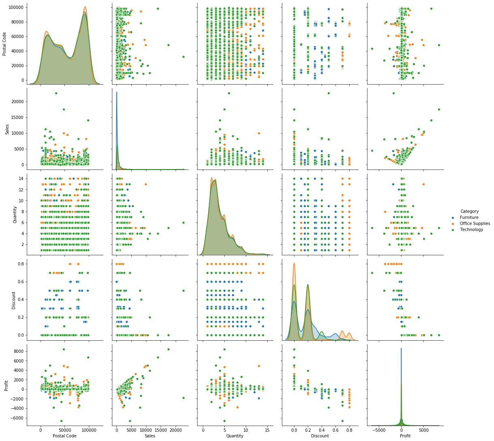
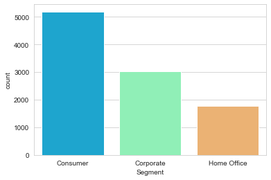
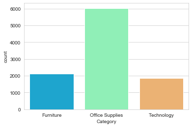
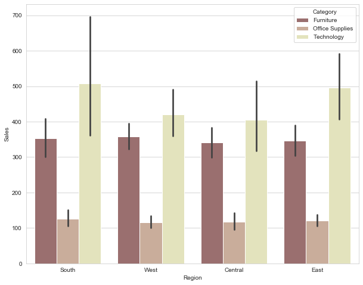
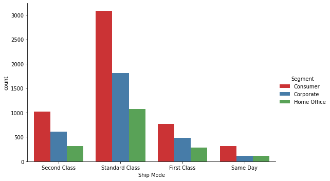
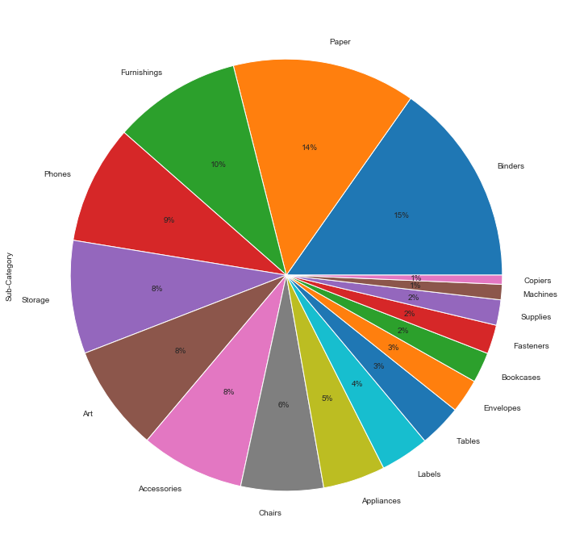

# Data_Visualization 

Data visualization is the graphic representation of data. It involves producing images that communicate relationships among the represented data to viewers of the images. This communication is achieved through the use of a systematic mapping between graphic marks and data values in the creation of the visualization.

## Problem :
   
Perform ‘Exploratory Data Analysis’ on the provided dataset ‘SampleSuperstore’
   
## Dataset:
  
   Data can be found at :  https://drive.google.com/file/d/1lV7is1B566UQPYzzY8R2ZmOritTW299S/view  
EDA: The dataset contains 9994 rows and 13 columns.This dataset gives the information about the store company which gives the information about different categories such as Furniture,Office supplies and Technologies etc which have been purchased by United states and even the number of sales for a particular category and quantity has been given.

## Import necessary libraries
  
 import numpy as np
 import pandas as pd
 import matplotlib.pyplot as plt
 import seaborn as sns
 
  
  
From the above graph we can visualize the distrubution of Furniture,Office supplies and technology based on Postalcode,sales,quantity,discount and profit

## Visualize the 'Segment' column from the dataset.

  
  
  Obsercvation: Consumer count is highest and are maximum who buy from the store compared to others
  
## Visualize the 'Category' column from the dataset.

  
  
  Observation: Office supplies items are being sold more compared to Furniture and Technology items
  
## Category wise sales in Each region

    
    
    Observation: In each and every every region, sales for 'Office Supplies' are very poor. Furniture and Technology are well ahead.
    
## Segment wise count of the ship modes

  
  
  Observation: Consumer count is highest in each case and they generally prefer "Standard Class"

  

  Observation: Binders holds the maximum percentage of sales among all other catrgories
  
## Conclusion
Scinerio shows large cities, like New York, Los Angeles are generating highest amount of Sales and Profit. And in case of Categories, Technology is always leading in terms of Sales and Profit,where as Office supplies are being sold more compared to Technology.some cities are there, where company is giving huge discounts but very less sales and profit is generating,And vice versa.To gain profit these issues need to be solved
